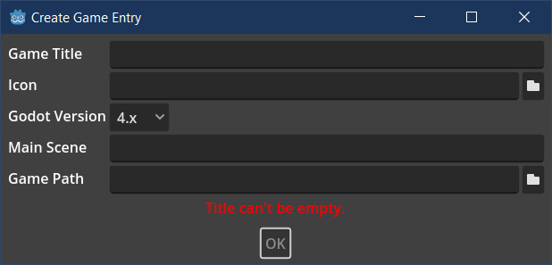

# Godot Universal Mod Manager

App for managing and creating mods for any Godot game, without needing to modify any of its files. Works with Godot 2, 3 and 4.

## How does this work

The manager takes advantage of two facts:
- you can add `override.cfg` to your game and override any project setting
- `Resource.take_over_path()` will make the resource literally take over the given path, so any `load()` calls will load it instead

With this, you can override the main scene and inject/replace any resource in the game.

### Caveats

There are a few things that make modding this way difficult or impossible:
- debugging a mod is difficult, especially if the game uses a modified Godot build
- in worst case, the game has no GDScript module, which makes this manager useless
- the files can also be encrypted, making it more difficult to tinker with them
- `take_over_path()` will not work when resources are loaded without cache (which is unlikely, but possible)
- if the game uses non-resource files, like `json` or `txt`, you won't be able to replace them with ResourceLoader
- to replace script or scene, you need to first get a copy of it and modify yourself, which is difficult outside the project

## Basics

### Game Descriptors

Before you make or add any mod, you need to register a game. Games are identified by game descriptors, which include: title, Godot version and main scene path. On first launch, you will be greeted with an empty list:


From here you can either import a game entry or create one. Each game entry is distributed in a separate folder with `game.cfg` and `icon.png` files. The idea is that an entry for a game is created only once and then shared by modding community etc. If you download an existing game entry, you can use the Import Game option. You need to provide path to the entry directory and the directory where the game is located (you need to have the game installed of course). The game directory is where the mods will be installed. If the "Copy Descriptor?" option is enabled, the entry directory will be copied to `user://Games/` directory of the mod manager.

If the game has no existing entry, you can create one by using Create Game Entry option.



The red error message at the bottom tells you what's wrong. Just edit the fields until the error goes away and you will be able able to create an entry. The Main Scene needs to be filed with the content of `main_scene` project setting of the game (e.g. `res://Scenes/Game.tscn`). Icon must be a `png` or `jpg` file. It will be automatically resized to 80x80 image (keeping aspect ratio). New entries are added to mod manager's user directory (`user://Games/`).

You can import/create a game entry that is already on your list.

### Game List

Once you added some entries, your game list will display all games you added to the manager:


You can also see how many mods each game has installed and how many are currently active. Folder icon next to each entry will open the directory where the entry is stored. The trash icon will remove the game from the list (no files are removed).

### Managing Game Mods

When you first open the game entry, your mod list will be empty too:


Aside from Import/Create options, which are pretty much the same as with games, there is a few more elements here. Godot version next to the game title, the Open Game Directory button that opens the installation directory of the game. The Enable Mods button will add GUMM loader to the installation directory. It consists of 2 things: `override.cfg` file and `GUMM_mod_loader.tscn` scene, which is entry point for loading mods. When these 2 files are in installed, launching your game will load all mods that are on your list and are active. Note that if a game already has `override.cfg`, mod loader will add its entries to the existing file.

Importing a mod is the same as importing game entry. You need a mod directory with `mod.cfg` file. Select the directory and you will see the mod information:


If a mod is already on your list, this operation will update it to the new version. Note that all mods are stored and referenced from their original directory, so it's up to you where to keep your mods. If you move or delete your mod, it will be automatically deactivated when manager starts and it will appear as missing:


You can either delete a missing mod or click the folder icon to assign it a new location. Once you have a few mod entries, you will be able to activate or deactivate specific mods:


If a mod is active and mods are enabled, it will be loaded when the game starts. Using the buttons on the right you can open the mod directory, edit its information (this is for mod creators) or delete it from the list. Deleting a mod does not delete any file.

## Creating Game Mods

### Creating Entry

Creating mod entries is the same as creating game entries:


Of note is the Path field, which needs to be pointing to an *empty* directory. The folder can be created from within the built-in file manager. Only Path and Name are mandatory. All other fields can be edited later. Icon will be resized to 80x80 PNG file (it does not modify the original). The icon can be added via Edit option, but it can't be changed once assigned.

### Mod Structure

Once you create a new mod, it will contain 3 files: `mod.cfg` that describes your mod and `mod.gd` which is the script loaded by the game. There is also `GUMM_mod.gd`, which provides basic API for managing mod data. It should not be edited and your `mod.png` extends this file. The resources you want to add/replace should be contained within the mod directory; can be inside sub-folders.

Note that these 3 files vary depending on Godot version. GUMM will automatically copy the files based on the Godot version specified in the game's entry. There are 3 supported versions: `2.x`, `3.x`, `4.x`. They API is designed to support all minor releases, so `3.x` can be used from `3.0` to `3.6` (which is e.g. why it doesn't use typing, which was added in `3.1`).

### Modding Basics

Your `mod.gd` starts with `_initialize()` method, which takes `SceneTree` as an argument. This method is called automatically and this is where you initialize your mod. The most important is `replace_resource_at()` method. It takes `path` and `resource`. What it does is register the given resource for the given path, using `take_over_path()` method. When the game tries to load the resource at the specified path, the `load()`/`preload()` method will instead return the resource you provided. This works as long as the resource remains in the memory, which is managed by GUMM.

Note that image and audio assets can't be loaded with `load()` and need to be loaded manually. The base modding script provides some helper methods to make it easier. Not all of them are available in all versions though. See next section for supported methods.

Example `_initialize()` implementation that replaces single file:
```GDScript
func _initialize(scene_tree: SceneTree) -> void:
	replace_resource_at("res://Nodes/Player/Player.png", load_texture("mod://Player.png"))
```
Note that `mod://` part is optional. The path will be converted to absolute path based on the main mod directory, which means you don't have to worry where your mode is located, as long as you use relative paths to files. If you load a resource that depends on another resource, you need to load the dependency first.

You can use the `scene_tree` argument to e.g. inject custom nodes into scene tree, which allows some more advanced modding techniques.

### Feature Support and Method List

|Feature|2.x|3.x|4.x|
|---|---|---|---|
|Load Textures|✔|✔|✔
|Load OGG|✖|✔|✖
|Load MP3|✖|✔¹|✔
|Load WAV²|✖|✖|✖
|Load GLTF²|✖|✖|✖

¹Since 3.3

²Might come in future versions

Basic methods:
- `replace_resource_at(path: String, resource: Resource)` - injects the provided resource into the specified path
- `load_resource(path: String)` - loads a resource from path relative to the mod directory
- `get_full_path(path: String)` - translates relative path into global path

Feature-dependent methods:
- `load_texture(path: String, flags: int = 7)` [Load Textures] - loads a texture using Image class. Note that `flags` is removed in Godot 4.x
- `load_ogg(path: String)` [Load OGG] - loads an OGG audio stream
- `load_mp3(path: String)` [Load MP3] - loads a MP3 audio stream

### Modding API

While GUMM does not require any modding support provided by the game, adding one would make modders' life easier. If you want to provide a modding API compatible with GUMM, all it requires is adding some methods available from a singleton. Provide this information to modders and they will be able to call these methods from the `mod.gd` file. For example:
```GDScript
func _initialize(scene_tree: SceneTree) -> void:
    var level = load_resource("mod://Level1.tscn")
	replace_resource_at("res://NewLevel.tscn", level)
    Globals.add_level("res://NewLevel.tscn")
```

### No Modding API

If the developer does not provide any modding API, you are on your own. Unless the game is protected, it's easy to unpack and decompile the scripts. Once you unpack the project, you can run it using your own Godot executable, which makes testing much easier. Opening the project in editor is more difficult, as the source assets need to be extracted first.

Keep in mind that, unless the project is open-source (which makes hacky modding pointless tbh), all assets are copyrighted. While personal use for modding purposes is *probably ok*, make sure your mods don't infringe the copyright by e.g. sharing some assets.

## Examples

GUMM comes with example mods for 3 games: Lumencraft, Spooky Ghosts Dot Com, Blastronaut Demo. Lumencraft has a free demo (mod-compatible), but Spooky Ghosts requires you to own the game if you want to see the mod in action.

The game entries are located in GameInfo directory. You can use these mods as a reference on how your mods can work and take note of some *advanced modding techniques* (like manual file copying or node injection).